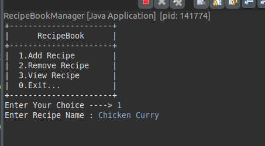
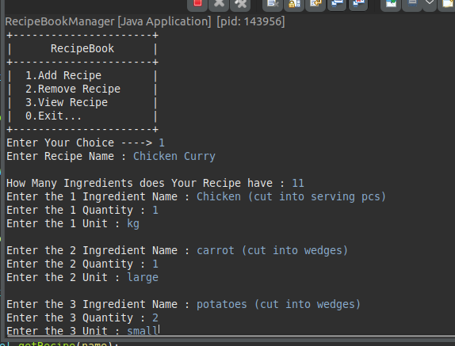
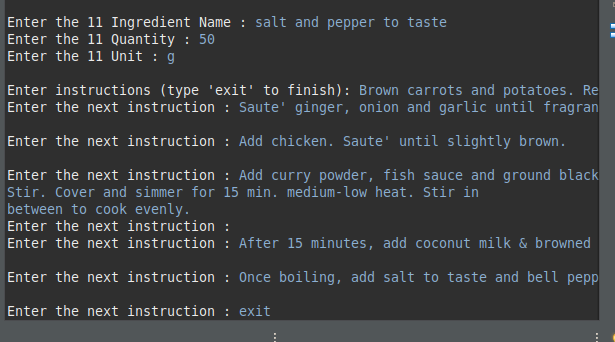
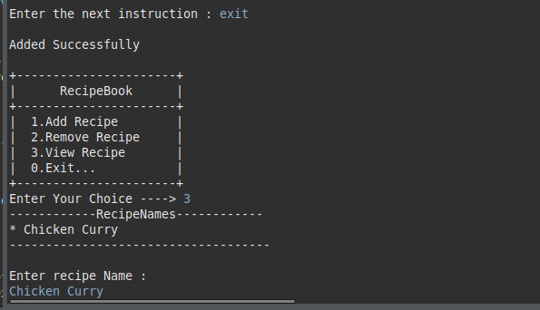
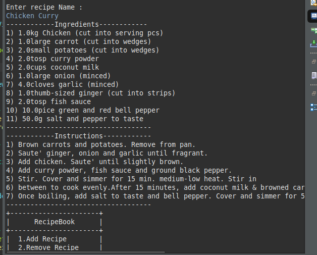

# RecipeBook Manager

## Table of Contents

1. About
2. Overview
3. Features
4. Planning
5. Components
    * Recipe Attributes
    * Ingredient Attributes
6. Implementation Details
7. Class Diagram
8. Mysql Tables
    * Recipe Table
    * Ingredient Table
    * Instruction Table
9. Getting Started
10. Preview

### About
 The RecipeBook Manager is a console-based application developed in Java that serves as a recipe management system. It allows users to add, remove, and view recipes, along with their ingredients and instructions.

### Overview

 The RecipeBook Manager simplifies the process of managing recipes, providing functionalities for adding new recipes, removing existing ones, and viewing recipe details. It's designed to handle various ingredients, quantities, and instructions associated with each recipe.

### Features

* __Add Recipe:__ Allows users to add new recipes with ingredients and instructions.
* __Remove Recipe:__ Enables users to remove existing recipes from the collection.
* __View Recipe:__ Provides information about registered recipes, including ingredients and instructions.

### Planning
* Project Duration: 7 days
* Type: Console Application
* Languages & Tools: Java, MySQL, Collections
* Contributor: 1

## Components
### Recipe Attributes
* Recipe Name
* Ingredients (List)
* Instructions (List)

## Ingredient Attributes
* Ingredient Name
* Quantity
* Unit

## Implementation Details
 The application is Java-based, following the __MVVM pattern__, and integrates with a MySQL database for persistent data storage.


### Class Diagram :

```
+----------------------+     +-----------------------+     +-----------------------+     +------------------------+
|  RecipeBookManager   |     |   AddRecipeView       |     |  RemoveRecipeView     |     |  ShowRecipeView        |
+----------------------+     +-----------------------+     +-----------------------+     +------------------------+
| - start()            |     | - addNewRecipe()      |     | - removeRecipe()      |     | - showRecipe()         |
| - info()             |     |                       |     |                       |     |                        |
|                      |     +-----------------------+     +-----------------------+     +------------------------+
|                      |             |                           |                           |
|                      |------------>|                           |                           |
|                      |             |                           |                           |
|                      |             v                           v                           v
|                      |     +---------------------+     +----------------------+     +----------------------+
|                      |     |   GetConnection     |     |  Recipe              |     |  Ingredient          |
|                      |     +---------------------+     +----------------------+     +----------------------+
|                      |     | - getConnection()   |     | - name: String       |     | - name: String       |
|                      |     | - closeConnection() |     | - ingredients: List  |     | - quantity: double   |
|                      |     +---------------------+     | - instructions: List |     | - unit: String       |
|                      |                                 +----------------------+     +----------------------+
+----------------------+                                      
                                                                                      
```
---------------------------------------------------------

## Mysql Tables

### Recipe Table

```sql
CREATE TABLE recipe (
    recipe_id INT PRIMARY KEY AUTO_INCREMENT,
    recipe_name VARCHAR(255) NOT NULL
);

```

### Ingredient Table

```sql
CREATE TABLE ingredient (
    ingredient_id INT PRIMARY KEY AUTO_INCREMENT,
    recipe_id INT,
    ingredient_name VARCHAR(255) NOT NULL,
    quantity DOUBLE NOT NULL,
    unit VARCHAR(50) NOT NULL,
    FOREIGN KEY (recipe_id) REFERENCES recipe(recipe_id)
);

```

### Instruction Table

```sql
CREATE TABLE instruction (
    instruction_id INT PRIMARY KEY AUTO_INCREMENT,
    recipe_id INT,
    instruction_text VARCHAR(255) NOT NULL,
    FOREIGN KEY (recipe_id) REFERENCES recipe(recipe_id)
);

```
-------------------


## Getting Started

> To run the RecipeBook Manager application locally, follow the instructions below:

1. Clone the repository to your local machine.
2. Set up the MySQL database as per the provided SQL schema.
3. Configure the database connection details in the application.
4. Compile and run the Java application.


## Preview


---

---

---

---

---